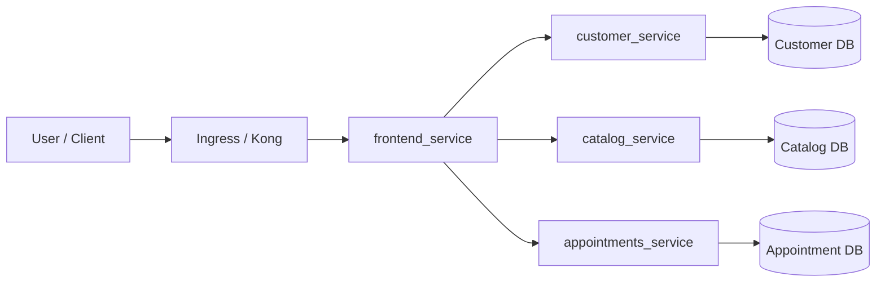
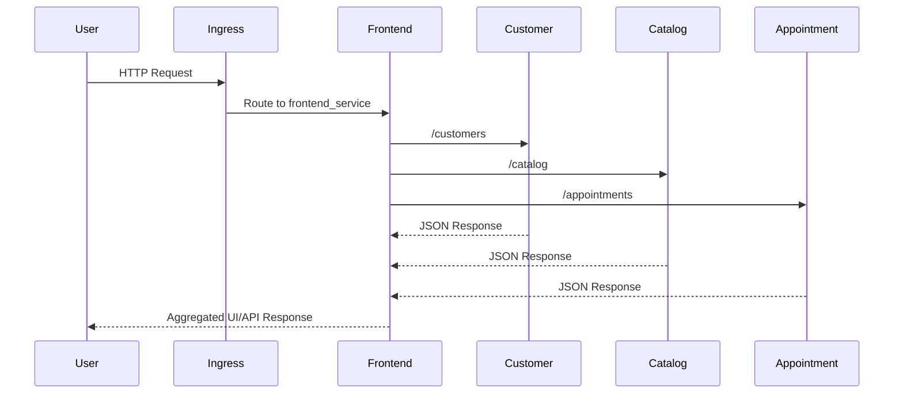

# SVS Microservices


Production-style Flask microservices reference implementation with Kubernetes deployment assets, ingress, observability manifests, and local development support.

## Table of Contents
- [1. Overview](#1-overview)
- [2. Screenshots](#2-screenshots)
- [3. Architecture](#3-architecture)
  - [3.1 System Context Diagram](#31-system-context-diagram)
  - [3.2 Request Flow Diagram](#32-request-flow-diagram)
  - [3.3 Repository Structure](#33-repository-structure)
- [4. Architecture Decisions](#4-architecture-decisions)
- [5. API Documentation](#5-api-documentation)
- [6. Local Development Guide](#6-local-development-guide)
- [7. Deployment Instructions](#7-deployment-instructions)
  - [7.1 Docker Compose Deployment](#71-docker-compose-deployment)
  - [7.2 Kubernetes Deployment](#72-kubernetes-deployment)
  - [7.3 Helm Chart Deployment](#73-helm-chart-deployment)
- [8. Infrastructure Documentation](#8-infrastructure-documentation)
- [9. CI/CD Documentation](#9-cicd-documentation)
- [10. Testing Guide](#10-testing-guide)
- [11. Security Considerations](#11-security-considerations)
- [12. Troubleshooting](#12-troubleshooting)

## 1. Overview
This project demonstrates:
- Frontend + backend Flask microservices.
- Database-per-service boundaries.
- Kubernetes-native deployment topology.
- Kong ingress routing support.
- Logging stack manifests (Loki, Fluent Bit, Grafana).

Primary use cases:
- Local microservices development.
- Kubernetes learning and experimentation.
- Debugging service-to-service communication.

## 2. Screenshots
> Add real environment captures as you deploy. Suggested file path: `docs/screenshots/`.

| Area | Placeholder |
|---|---|
| Frontend Home | `docs/screenshots/frontend-home.png` |
| Kubernetes Workloads | `docs/screenshots/k8s-workloads.png` |
| Grafana Dashboard | `docs/screenshots/grafana-dashboard.png` |

## 3. Architecture

### 3.1 System Context Diagram


### 3.2 Request Flow Diagram


### 3.3 Repository Structure
```text
.
├── app-services/
│   ├── appointments_service/
│   ├── catalog_service/
│   ├── customer_service/
│   ├── frontend_service/
│   └── db/
├── k8s/
│   ├── configmaps/
│   ├── deployments/
│   ├── ingress/
│   ├── logging/
│   ├── services/
│   ├── sa/
│   └── svs-microservices-chart/
├── troubleshooting/
└── docker-compose.yml
```

## 4. Architecture Decisions
- **Microservices over monolith:** Enables independent deployment and focused ownership.
- **Database-per-service:** Reduces tight coupling and preserves service boundaries.
- **Kubernetes-first manifests:** Production-like operations model, even in local clusters.
- **Ingress via Kong:** Central routing, future-ready for auth/policies/rate limits.
- **ConfigMaps + Secrets:** Environment-specific runtime config separated from app images.

## 5. API Documentation
High-level service endpoints (update with exact routes as services evolve):

| Service | Purpose | Example Base URL |
|---|---|---|
| `frontend_service` | UI + orchestration layer | `http://localhost:<frontend-port>` |
| `customer_service` | Customer CRUD/domain operations | `http://customer-service:5000` |
| `catalog_service` | Catalog CRUD/domain operations | `http://catalog-service:5000` |
| `appointments_service` | Appointment scheduling operations | `http://appointment-service:5000` |

Recommended API doc approaches:
- OpenAPI generation per service.
- `/health` and `/ready` endpoints for runtime checks.
- Versioned paths (e.g., `/api/v1/...`) before external exposure.

## 6. Local Development Guide
### Prerequisites
- Docker
- Python 3.10+
- `pip`
- `kubectl`
- `kind` (optional for local Kubernetes)
- `helm` (optional for Kong)

### Start with Docker Compose
```bash
docker compose up --build
```

### Service-focused workflow (optional)
1. Navigate to a service folder in `app-services/`.
2. Create and activate a Python virtual environment.
3. Install dependencies from `requirements.txt`.
4. Run the service locally and verify endpoints.

### Local networking notes
- If running outside Kubernetes, ensure service URLs point to local ports.
- If running inside Kubernetes, use Kubernetes DNS service names.

## 7. Deployment Instructions

### 7.1 Docker Compose Deployment
```bash
docker compose up -d --build
docker compose ps
```

### 7.2 Kubernetes Deployment
```bash
kubectl create ns svs-microservices || true
kubectl apply -f k8s/ -n svs-microservices
kubectl get pods -n svs-microservices
kubectl get svc -n svs-microservices
```

### 7.3 Helm Chart Deployment
Helm chart location: `k8s/svs-microservices-chart/`

```bash
helm upgrade --install svs-microservices ./k8s/svs-microservices-chart \
  --namespace svs-microservices \
  --create-namespace
```

## 8. Infrastructure Documentation
### Kubernetes Assets
- **Deployments:** `k8s/deployments/`
- **Services:** `k8s/services/`
- **Ingress:** `k8s/ingress/`
- **ConfigMaps:** `k8s/configmaps/`
- **ServiceAccounts / RBAC:** `k8s/sa/`, `k8s/cluster-role-binding/`
- **Helm chart:** `k8s/svs-microservices-chart/`

### Observability Stack
Located under `k8s/logging/`:
- Fluent Bit daemonset + RBAC.
- Loki deployment + service.
- Grafana deployment + service.

## 9. CI/CD Documentation
Current repository includes Kubernetes and deployment assets suitable for CI/CD workflows.

Recommended pipeline stages:
1. **Lint & test** all Python services.
2. **Build container images** per service.
3. **Security scanning** (SAST + image scanning).
4. **Push images** to registry.
5. **Deploy to cluster** with `kubectl` or Helm.
6. **Post-deploy health checks** and rollout validation.

Example deployment checks:
```bash
kubectl rollout status deployment/frontend-service -n svs-microservices
kubectl get ingress -n svs-microservices
```

## 10. Testing Guide
### Local tests
Run tests from each service directory:
```bash
pytest -q
```

### Integration checks
```bash
kubectl get pods -n svs-microservices
kubectl logs deployment/frontend-service -n svs-microservices --tail=100
```

### Smoke test ingress
```bash
curl -i http://<ingress-host>/
```

## 11. Security Considerations
- Do not commit plaintext secrets; use Kubernetes Secrets or external secret stores.
- Enforce least privilege for ServiceAccounts and RBAC bindings.
- Prefer signed and scanned container images.
- Pin dependency versions and patch regularly.
- Use TLS for ingress in non-local environments.
- Treat insecure local registry (`http` + `skip_verify`) as local-only.

## 12. Troubleshooting
For common issues, start with:
- `troubleshooting/service-url-issue.md`

Quick diagnostics:
```bash
kubectl get all -n svs-microservices
kubectl describe pod <pod-name> -n svs-microservices
kubectl logs <pod-name> -n svs-microservices
kubectl get events -n svs-microservices --sort-by=.metadata.creationTimestamp
```

If ingress fails:
- Verify ingress controller is running.
- Check ingress resource host/path rules.
- Validate local `/etc/hosts` mappings for custom hostnames.
